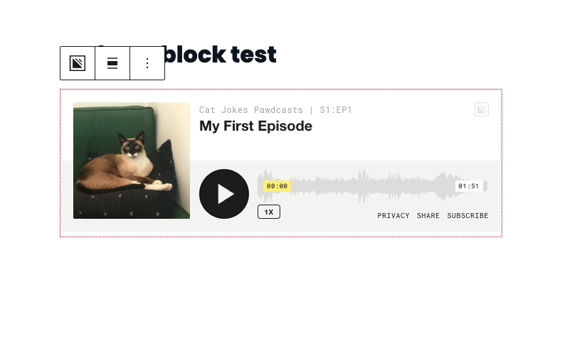
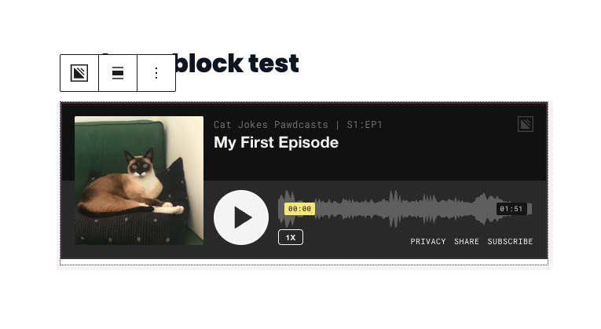
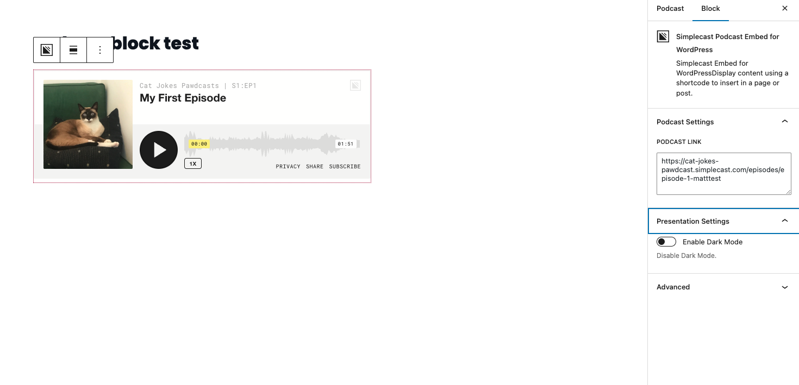
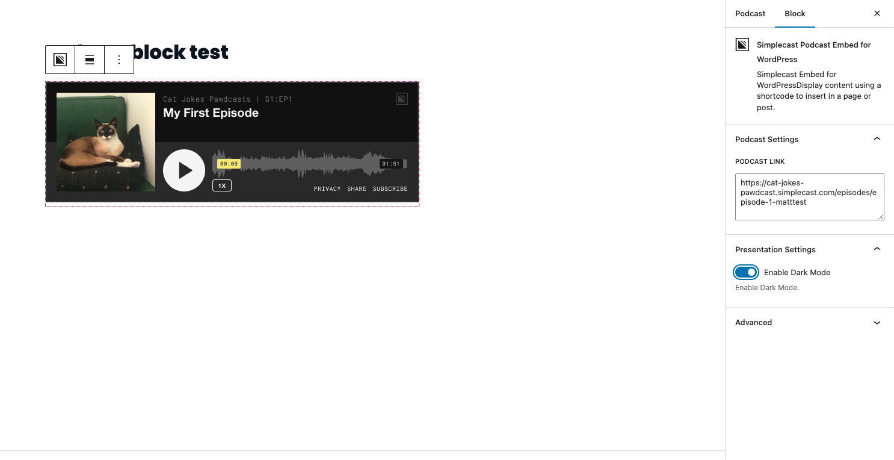

# Simplecast Embed for WordPress

This plugin allows custom Wordpress installed sites to use a short code for embedding Simplecast audio players into their site's content.

## Installation
To install this plugin, please follow one of the installation methods from the Wordpress docs: https://wordpress.org/support/article/managing-plugins/#installing-plugins

## Usage

### Shortcode for classic editor.
Once the plugin is installed and is active, you will be able to use the following short code syntax to display a Simplecast audio player.

```[simplecast-embed src="https://cat-jokes-pawdcast.simplecast.com/episodes/episode-1-matttest"]```

The `src` value for your short code is the Embed Short Link found on the Episode Overview page of your Simplecast Dashboard.

### Block for classic editor.
Once the plugin is installed and is active, you have the option to insert a simplecast embed block. See some screnshots.

## Screenshots
Light mode Block view


Dark mode Block view


Light mode Block with settings


Dark mode Block with settings


## Changelog
Visit the [readme](./readme.txt)